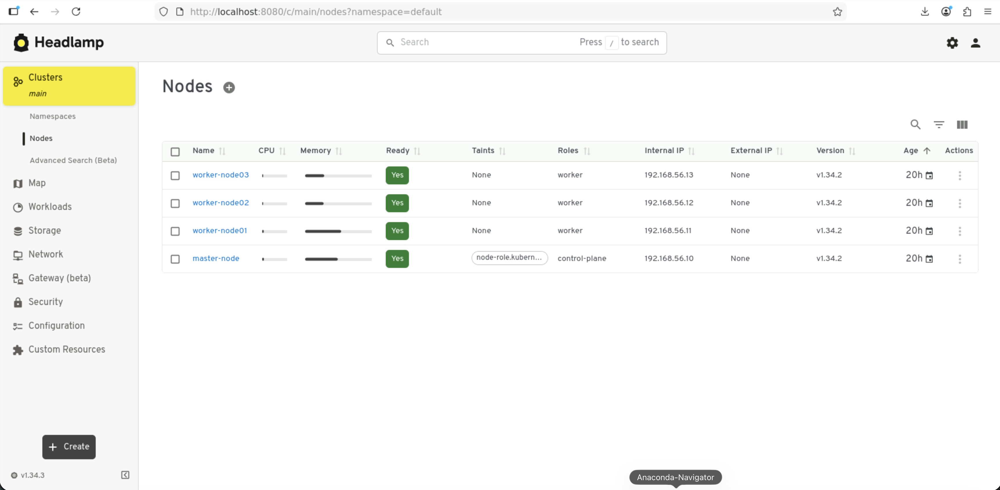

# LAB 0 - Découverte et prise en main du cluster Kubernetes

**Durée estimée : 20 minutes**

**Contexte :**
Pour optimiser le temps de formation et nous concentrer sur l'utilisation de Kubernetes, le cluster a déjà été pré-installé sur votre environnement.

### Objectifs du TP

1. Comprendre l'architecture qui a été déployée pour vous.
2. Connecter votre outil de commande local (`kubectl`) au cluster.
3. Accéder au **Dashboard Kubernetes** (interface web).
4. Faire l'inventaire de ce qui est déjà installé (namespace, stockage...)

---

## Partie 1 : Comprendre l'infrastructure en place

Avant de toucher au clavier, il est important de comprendre ce qui tourne actuellement sur votre machine.

Nous avons automatisé le déploiement d'une architecture **"Multi-Node"** standard. Au lieu d'installer les composants un par un manuellement, nous avons utilisé :

* **Vagrant & VirtualBox :** pour créer les machines virtuelles.
* **Kubeadm :** l'outil officiel de la communauté Kubernetes pour "bootstraper" (démarrer) un cluster de manière sécurisée et standardisée.

**Ce qui tourne actuellement :**

* **1 nœud Master (Control Plane) :** c'est le chef d'orchestre. Il contient la base de données (etcd), l'API Server, le scheduler et le controller manager.
* **3 nœuds Workers (node01, node02, node03) :** c'est là que vos applications (conteneurs) vont réellement tourner.
* **Le Dashboard :** l'interface web officielle a déjà été pré-déployée dans le cluster.

> **Pour les curieux (documentation officielle) :**
> Pour voir comment on installe un cluster "from scratch" avec Kubeadm : [Documentation Kubeadm](https://kubernetes.io/docs/setup/production-environment/tools/kubeadm/create-cluster-kubeadm/).
>
> Le projet officiel [Kubernetes Dashboard](https://github.com/kubernetes-retired/dashboard) a été archivé en faveur du projet [Headlamp](https://github.com/kubernetes-sigs/headlamp) : c'est ce que nous avons installé.

**Vérification de l'état des machines :**
Ouvrez un terminal dans le dossier du projet et vérifiez que les VMs sont bien allumées.

```bash
cd ~/k8s-install
vagrant status
```

> **Résultat attendu :** `master`, `node01`, `node02` et `node03` avec le statut **running**.

---

## Partie 2 : Connexion au cluster (configuration du client)

Pour discuter avec le cluster sans entrer en SSH dans les VMs, nous utilisons l'outil `kubectl`.

**1. Installation de l'outil** *(déjà fait sur vos machines)*

Documentation : [Installation de kubectl sur Linux](https://kubernetes.io/docs/tasks/tools/install-kubectl-linux/)

**2. Fichier kubeconfig ("carte d'identité" du cluster)** *(déjà fait sur vos machines)*

Pour savoir où se connecter et avec quels droits, `kubectl` lit un fichier de configuration appelé `kubeconfig`. Il a été généré lors de l'installation automatique et placé à l'emplacement attendu : `~/.kube/config`.

**3. Test de la connexion**

Interrogez le cluster pour lister les nœuds. Si la commande répond, la connexion est établie.

```bash
kubectl get nodes
```

Un alias `k` pour `kubectl` est configuré. Affichez cette fois les informations détaillées :

```bash
k get nodes -o wide
```

> **Résultat attendu :**
> ```text
> NAME            STATUS   ROLES           AGE   VERSION   INTERNAL-IP     EXTERNAL-IP   OS-IMAGE             KERNEL-VERSION     CONTAINER-RUNTIME
> master-node     Ready    control-plane   20m   v1.35.4   192.168.56.10   <none>        Ubuntu 24.04.3 LTS   6.8.0-86-generic   containerd://2.2.0
> worker-node01   Ready    worker          17m   v1.35.4   192.168.56.11   <none>        Ubuntu 24.04.3 LTS   6.8.0-86-generic   containerd://2.2.0
> worker-node02   Ready    worker          14m   v1.35.4   192.168.56.12   <none>        Ubuntu 24.04.3 LTS   6.8.0-86-generic   containerd://2.2.0
> worker-node03   Ready    worker          12m   v1.35.4   192.168.56.13   <none>        Ubuntu 24.04.3 LTS   6.8.0-86-generic   containerd://2.2.0
> ```
>
> Si vous voyez `Ready` partout, félicitations : vous êtes administrateur du cluster.

**Notez les noms de vos nœuds** (`worker-node01`, etc.) et leurs IP : vous en aurez besoin dans plusieurs labs.

---

## Partie 3 : Accès au Dashboard (interface graphique)

Documentation : [Headlamp](https://headlamp.dev/docs/latest/)

Le Dashboard est déjà installé.

### Étape 1 : Génération du token et création du tunnel

Exécutez le script `access-dashboard.sh`. Il génère un token d'authentification temporaire et ouvre un tunnel vers le conteneur Headlamp qui tourne dans le cluster.

**Ne fermez pas ce terminal.**

> ⚠️ **Important :** une longue chaîne de caractères s'affiche. **Copiez-la** (sélection + clic droit, ou Ctrl+C), vous en avez besoin à l'étape suivante.

### Étape 2 : Connexion via le navigateur

1. Ouvrez votre navigateur web.
2. Allez sur [http://localhost:8080](http://localhost:8080).
3. Collez le jeton récupéré à l'étape 1 et validez.

### Étape 3 : Exploration

Vous voilà sur l'interface. Naviguez et repérez : la liste des nœuds, les namespaces, les Pods du namespace `kube-system`.



